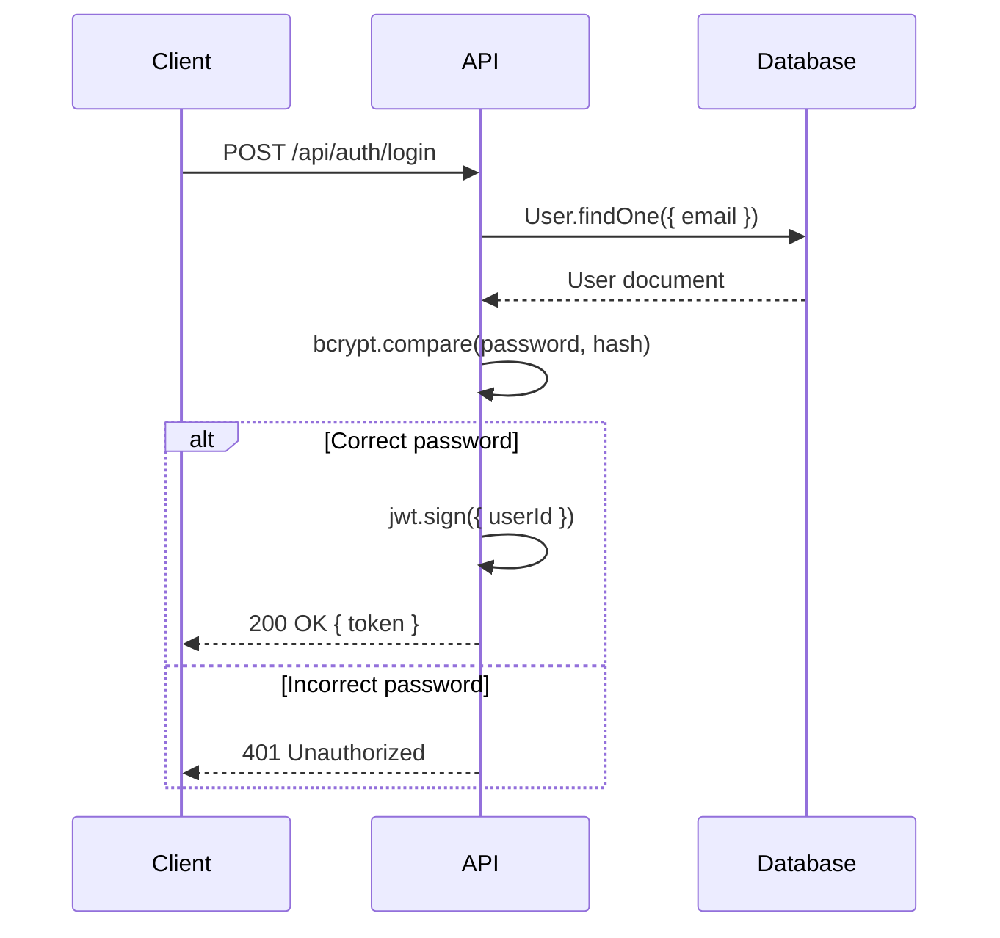
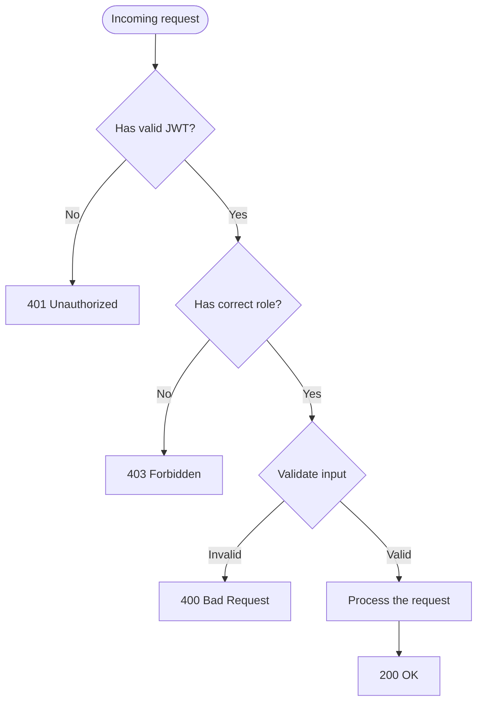
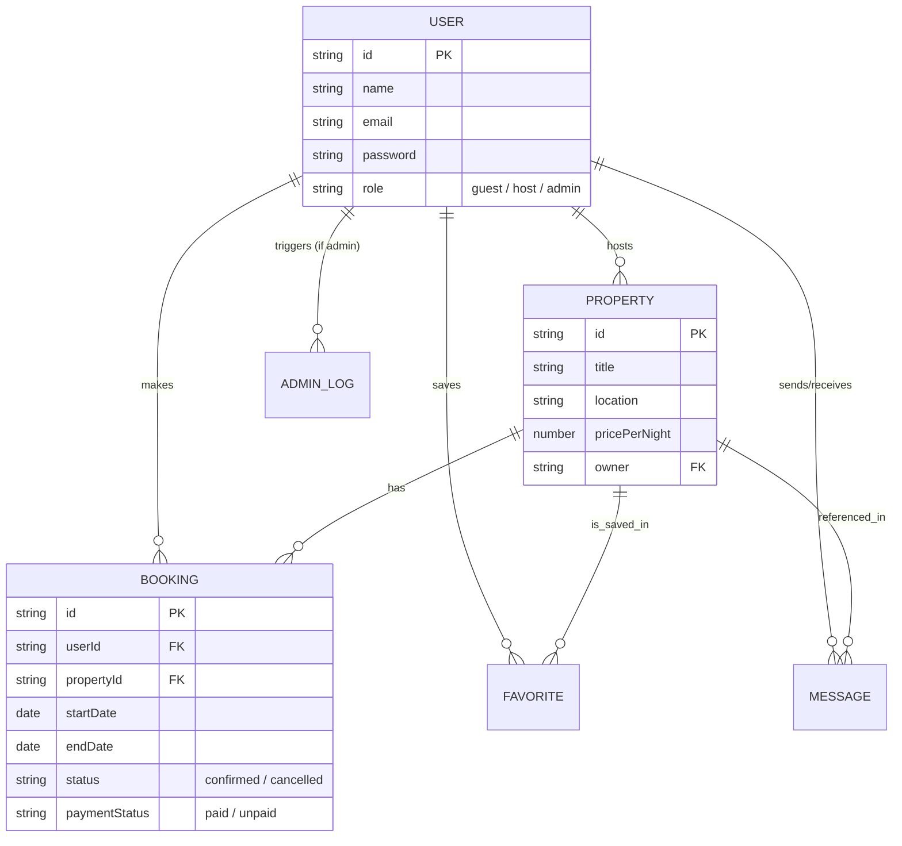

 ```mermaid
graph TD
    A[Incoming Request] --> B{authMiddleware}
    B -- No Token / Invalid --> C[401 Unauthorized]
    B -- Valid Token --> D{roleMiddleware}
    
    D -- Unauthorized Role --> E[403 Forbidden]
    D -- Allowed Role --> F{Zod Validation / Schema Parse}
    
    F -- Bad Input Data --> G[400 Bad Request]
    F -- Valid Data --> H[Controller Execution]
    H --> I[Success Response]
 ```

 ```mermaid
    sequenceDiagram
    autonumber
    actor Frontend as Frontend Client
    participant API as Booking Controller
    participant DB as MongoDB
    participant Mail as Nodemailer

    Frontend->>API: POST /api/v1/bookings (dates, propertyId)
    API->>DB: Find overlapping non-cancelled bookings
    alt Conflict Found
        DB-->>API: Overlap Detected
        API-->>Frontend: 409 Conflict ("Boendet är redan bokat")
    else No Conflict
        API->>DB: Fetch Property pricePerNight
        API->>DB: Create Booking (status: confirmed, paymentStatus: unpaid)
        API->>DB: Fetch Guest Email Context
        critical Async Email Dispatch
            API->>Mail: Trigger sendBookingConfirmation()
        end
        API-->>Frontend: 201 Created (Booking Data)
    end
```

 ```mermaid
stateDiagram-v2
    [*] --> Guest : Registration default
    
    state Guest {
        [*] --> Browsing
        Browsing --> BookingStay
    }
    
    state Host {
        [*] --> Dashboard
        Dashboard --> CreatingListings
        Dashboard --> ReviewingBookings
    }

    Guest --> Host : switchRole() API call
    Host --> Guest : switchRole() API call
```
