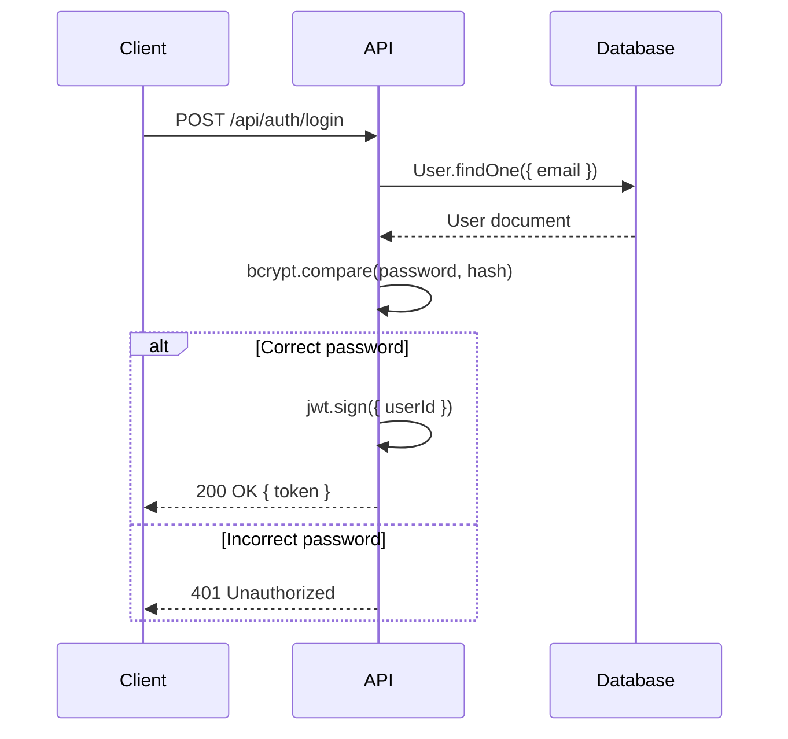
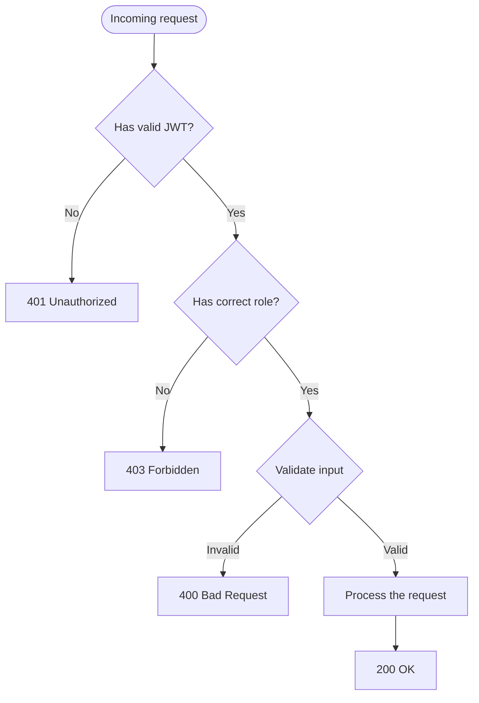

```mermaid
sequenceDiagram
participant C as Client
participant A as API
participant DB as Database

C->>A: POST /api/auth/login
A->>DB: User.findOne({ email })
DB-->>A: User document
A->>A: bcrypt.compare(password, hash)

alt Correct password
    A->>A: jwt.sign({ userId })
    A-->>C: 200 OK { token }
else Incorrect password
    A-->>C: 401 Unauthorized
End
```

```mermaid
flowchart TD

Start([Incoming request]) --> Auth{Has valid JWT?}
Auth -->|No| Reject[401 Unauthorized]
Auth -->|Yes| Role{Has correct role?}
Role -->|No| Forbidden[403 Forbidden]
Role -->|Yes| Validate{Validate input}
Validate -->|Invalid| BadRequest[400 Bad Request]
Validate -->|Valid| Process[Process the request]
Process --> Response[200 OK]
```
